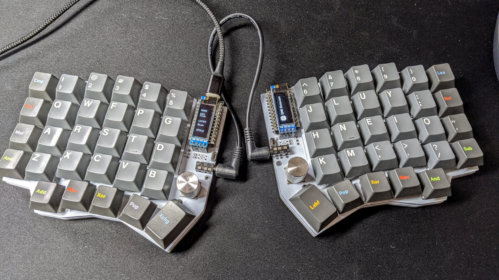
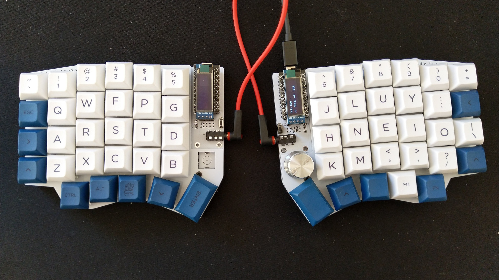
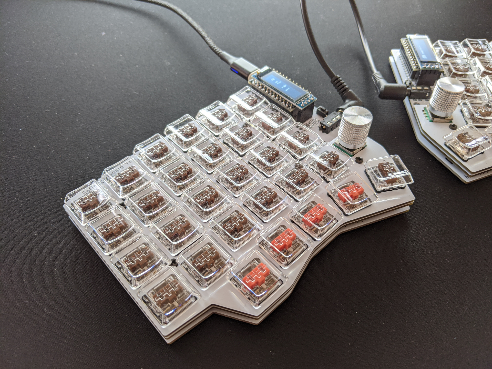
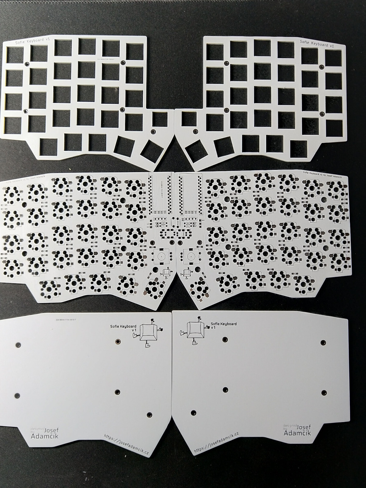

# Sofle Keyboard

Sofle is 6×4+5 keys column-staggered split keyboard with encoder support. Based on [Lily58](https://github.com/kata0510/Lily58), [Corne](https://github.com/foostan/crkbd) and [Helix](https://github.com/MakotoKurauchi/helix) keyboards.

**[For more information and documentation visit https://josefadamcik.github.io/SofleKeyboard/](https://josefadamcik.github.io/SofleKeyboard/)**

SofleKeyboard was created by [Josef Adamcik](https://josef-adamcik.cz/). The motivation and process is covered in following blog-post: [Let me introduce you SofleKeyboard - a split keyboard based on Lily58 and Crkbd](https://josef-adamcik.cz/electronics/let-me-introduce-you-sofle-keyboard-split-keyboard-based-on-lily58.html)

Sofle RGB was contributed by [Dane Evans](https://github.com/DaneEvans).

Sofle soldered was contributed by [kb-elmo](https://github.com/kb-elmo)

## Firmware 

Sofle uses [QMK firmware](https://qmk.fm/)

## Default layout 

## Images of keyboard

