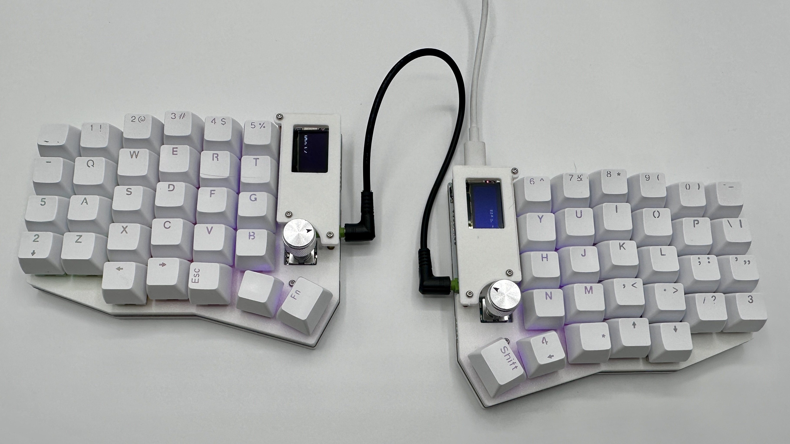
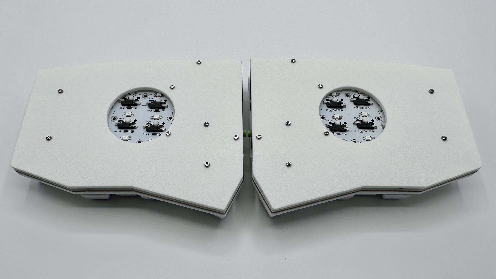
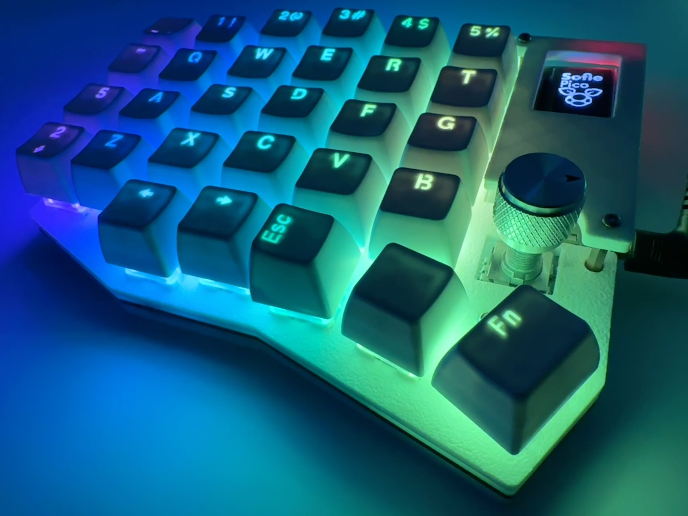
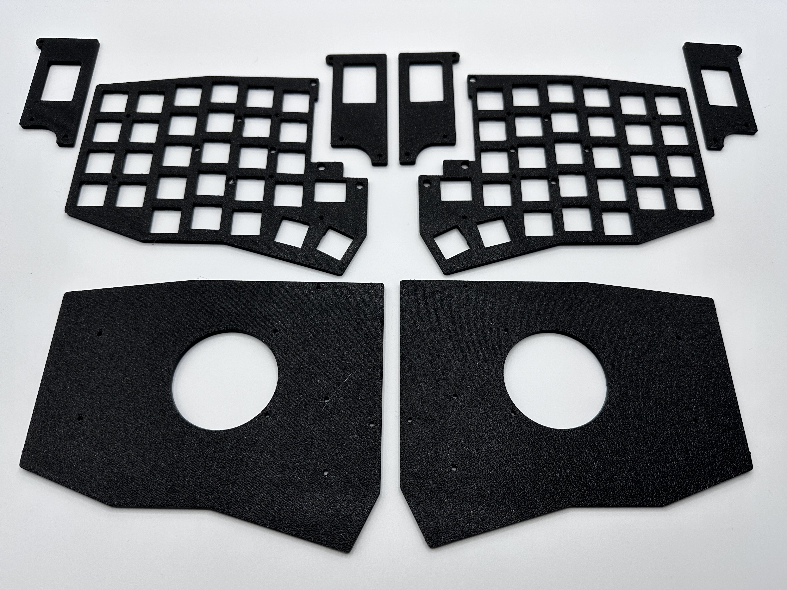
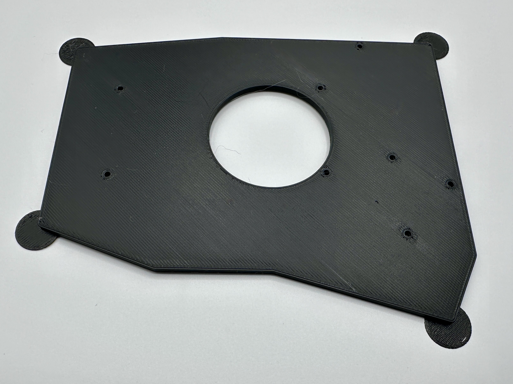
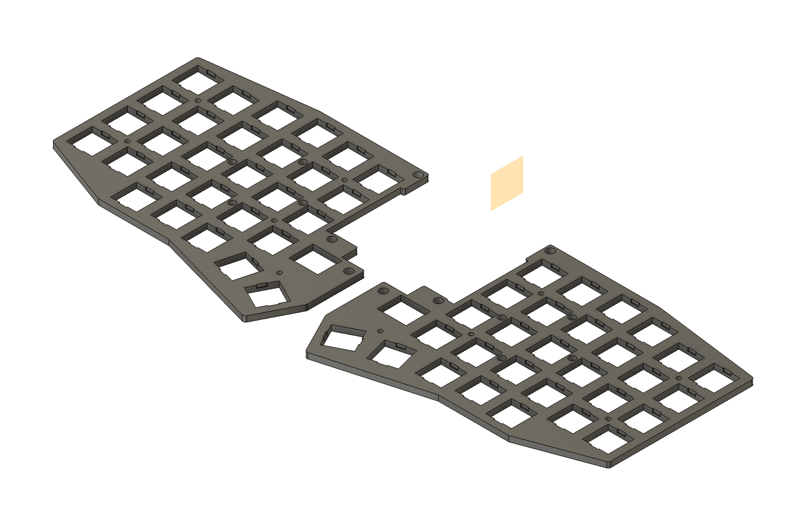
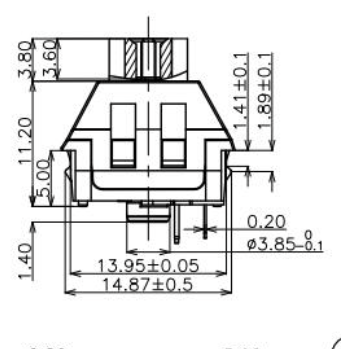
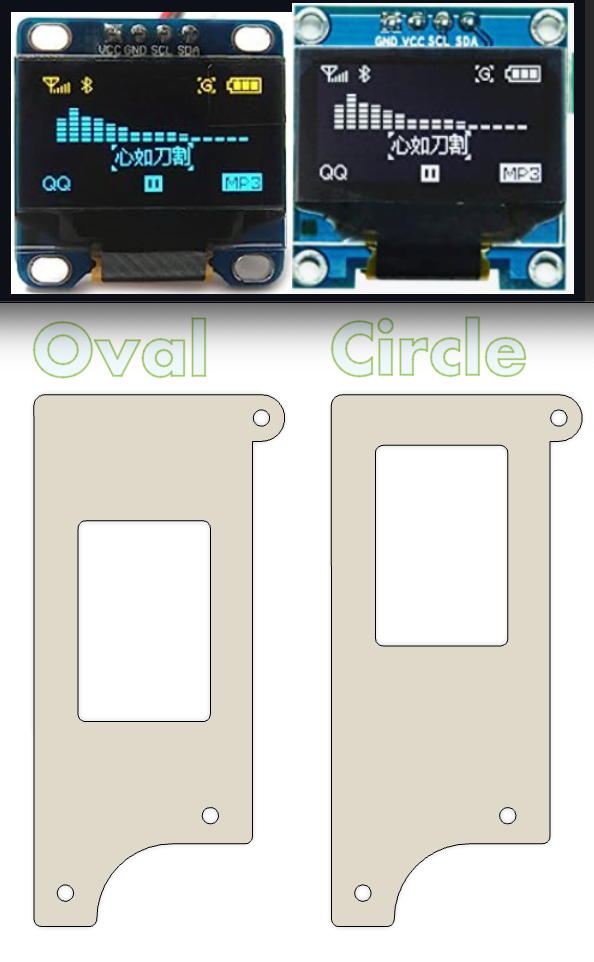

# 3d printable Sofle Pico case
This is also posted on [Printables](https://www.printables.com/model/760098-sofle-pico-case). You'll find the latest discussion there.

  

## BOM
 | Name | Count | Remarks | Potential Storefront |
|-|-|-|-|
| keyplates   | 2 | `sofle_pico_keyplate_notched_LH_v3.5.5.stl`   and   `sofle_pico_keyplate_notched_RH_v3.5.5.stl` | |
| backplates  | 2 | `sofle_pico_backplate_v3.4.stl` | |
| OLED plates | 2 | Note there are variants for the different types of OLED's that have higher/lower holes. `Sofle_pico_OLED_oval_window_v3.4.stl` and `Sofle_pico_OLED_circle_window_v3.4.stl`| |
|M2 5mm screws|32| Any old M2 will do. I prefer 'button head' for aesthetics. 4mm or 6mm works too, but 6mm may bottom out. |[Amazon](https://www.amazon.com/gp/product/B07ZH6GRK2) [AliExpress](https://www.aliexpress.us/item/3256805706765925.html)|
| M2 6mm female-female standoffs | 10 | Connects the front plate to the back plate, runs _through_ the pcb. Aluminum versions are available, but I've found they tend to arrive 'greasy', so I recommend the brass versions.|[Amazon](https://www.amazon.com/gp/product/B07B9X1KY6) [AliExpress](https://www.aliexpress.us/item/3256804317893173.html)|
| M2 18mm female-female standoffs | 6 | Connects the OLED plate to the back plate, runs _through_ the pcb and the key plate. These can be harder to find in small quantities. You can use an assortment kit to make these. |[Amazon](https://www.amazon.com/gp/product/B07B9X1KY6) [AliExpress](https://www.aliexpress.us/item/3256804317893173.html)|
| 2mm adhesive Rubber bumper feet. | 10| Stick on the underside of the bottom keyboard to keep it from sliding around on the desk. | [amazon](https://www.amazon.com/ROCHU-Self-Adhesive-Rubber-Bumpons-Furniture/dp/B073SVKFYJ) |

## Details
The slicer-ready files can be found in the "production_ready" folder. These are 3mm thick. 'Helper discs' are recommended on the corners to prevent curling.

The latest version of the key plates have notches that the switches slot into. The non-notched earlier version of the key plate have been removed from the repo. The notched key plate should be printed with the pretty side toward the print bed, so there is a right hand & left hand versions of the file.

 

There are two variants for the OLED covers due to the two types of OLEDs that can be used. 

If you make a set, can you submit a PR with some pictures?

## About these plates
These plates were created by exporting svg layers directly from KiCad. The Svg's were imported into Fusion360 with a 3.7795% scale. (Not sure why the KiCad exports are so small - but that multiplier seems to get them where they need to go). The svg sketches were fixed up, then extruded to 3mm.

The fusion 360 export is included in the 'source' folder. Feel free to get fancy with it!