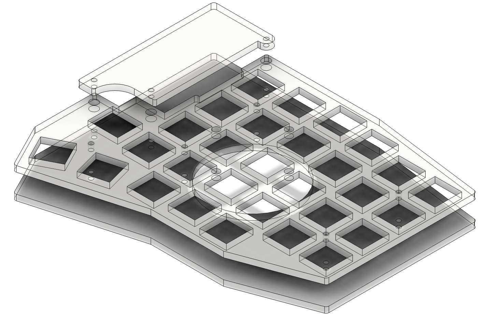

# Acrylic case

@todo add some hero images.

## Details
These don't retain the switches as tightly as the 3d printed or the PCB cases, but they look fantastic. You can use rubber bump feet between the front plate and the PCB to improve switch retention. (See note in bom).

The production ready files for upload can be found in the "production_ready" folder. They are zipped .dxf files. I recommend 3mm thickness.

## BOM
 | Name | Count | Remarks | Potential Storefront |
|-|-|-|-|
| keyplates   | 2 | `sofle_pico_keyplate_notched_LH_v3.5.5.stl`   and   `sofle_pico_keyplate_notched_RH_v3.5.5.stl` | |
| backplates  | 2 | `sofle_pico_backplate_v3.4.stl` | |
| OLED plates | 2 | Note there are variants for the different types of OLED's that have higher/lower holes. `Sofle_pico_OLED_oval_window_v3.4.stl` and `Sofle_pico_OLED_circle_window_v3.4.stl`| |
|M2 5mm screws|32| Any old M2 will do. I prefer 'button head' for aesthetics. 4mm or 6mm works too, but 6mm may bottom out. |[Amazon](https://www.amazon.com/gp/product/B07ZH6GRK2) [AliExpress](https://www.aliexpress.us/item/3256805706765925.html)|
| M2 6mm female-female standoffs | 10 | Connects the front plate to the back plate, runs _through_ the pcb. Aluminum versions are available, but I've found they tend to arrive 'greasy', so I recommend the brass versions.|[Amazon](https://www.amazon.com/gp/product/B07B9X1KY6) [AliExpress](https://www.aliexpress.us/item/3256804317893173.html)|
| M2 18mm female-female standoffs | 6 | Connects the OLED plate to the back plate, runs _through_ the pcb and the key plate. These can be harder to find in small quantities. You can use an assortment kit to make these. |[Amazon](https://www.amazon.com/gp/product/B07B9X1KY6) [AliExpress](https://www.aliexpress.us/item/3256804317893173.html)|
| 2mm adhesive Rubber bumper feet. | 20 | These improve switch retention, and keep the board from sliding on the desk. Put 5 on the top of each PCB, below the keyplate. Since the acrylic keyplate doesn't nestle into the switch retention nubs, placing these bumps between the plate and the pcb keeps the plate from flexing. Put another 5 on the bottom side of each hand to keep from sliding on the desk. @todo - add images. | [amazon](https://www.amazon.com/ROCHU-Self-Adhesive-Rubber-Bumpons-Furniture/dp/B073SVKFYJ) |

## About these plates
This case was created by exporting svg layers directly from KiCad. The Svg's were imported into Fusion360 with a 3.7795% scale. (Not sure why the KiCad exports are so small - but that multiplier seems to get them where they need to go). From Fusion360, the outlines are exported as a .dxf. The .dxf's have been zipped because the only vendor I've tested these with is Elecrow. If you need another file type, you can find the initial svg's in the 'source' folder.

