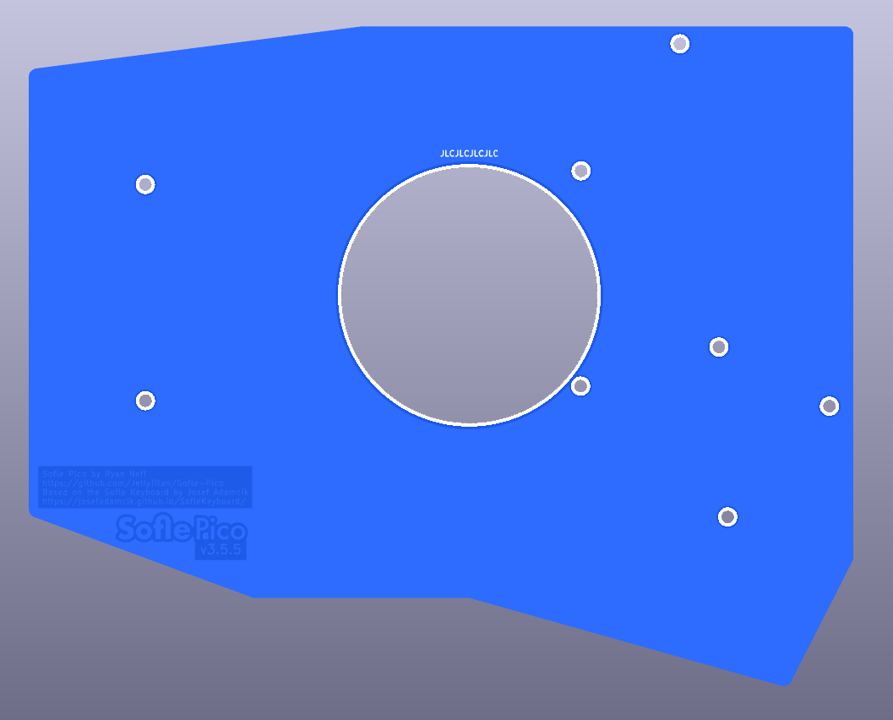
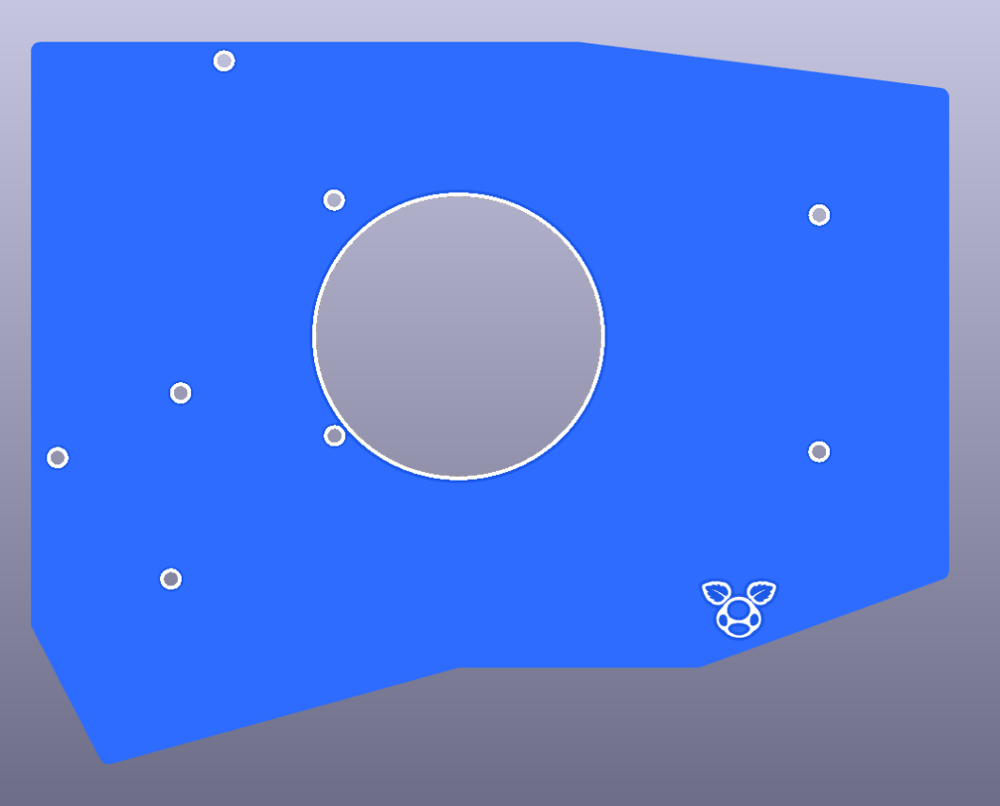

# PCB Case
> [!WARNING]
> These plates have not been tested in production. They are the same as the 3d printed plates, so I have a high degree of confidence they will work. If you do make these, please let me know so I can mark them as validated, or submit a PR. Also, some 'hero' shots would be great for the repo!
  

## Details
Order as you would a normal PCB. These are thinner than the acrylic or 3d printed cases, but have a much better acoustic profile. The PCB retains switches better than the acrylic, and as well as the 3d printed cases, so this is a good choice for travelers or thin builds.

There are 2 types of backplates, one with a puck hole and one without the puck hole. The files are named accordingly.

To reduce cost, you can use a PCB key plate, and a 3d printed or acrylic back.

PCB vendors may add an additional charge for 'extra holes' when ordering the front plate. (Looking at you, JLC). The application of this fee has been really inconsistent. YMMV.

## BOM
| Name | Count | Remarks | Potential Storefront |
|-|-|-|-|
| keyplates | 2 | | Elecrow or JLC |
| backplates | 2 | Can be substituted with Acrylic or 3d printed. | Elecrow or JLC |
| OLED plates | 2 | These should be made with Acrylic. The file can be found in the Acrylic case folder. `sofle_pico_OLED_v3.4.dxf.zip`  |Elecrow |
|M2 5mm screws|32| Any old M2 will do. I prefer hex cap for aesthetics. 6mm or 4mm works just fine too.|[Amazon](https://www.amazon.com/gp/product/B07ZH6GRK2) [AliExpress](https://www.aliexpress.us/item/3256805706765925.html)|
| M2 8mm female-female standoffs | 10 | Connects the front plate to the back plate, runs _through_ the pcb. If you are using an acrylic or 3d printed back plate, you'll still want the 8mm standoffs. |[M2 Brass Standoff Kit](https://www.amazon.com/gp/product/B07B9X1KY6) [AliExpress](https://www.aliexpress.us/item/3256804317893173.html)|
| M2 18mm female-female standoffs | 6 | Connects the OLED plate to the back plate, runs _through_ the pcb and the key plate. These can be harder to find in small quantities. You can use an assortment kit to make these. |[Amazon](https://www.amazon.com/gp/product/B07B9X1KY6) [AliExpress](https://www.aliexpress.us/item/3256804317893173.html)|
| 2mm adhesive Rubber bumper feet. | 10| Stick on the underside of the bottom keyboard to keep it from sliding around on the desk. | [amazon](https://www.amazon.com/ROCHU-Self-Adhesive-Rubber-Bumpons-Furniture/dp/B073SVKFYJ) |
