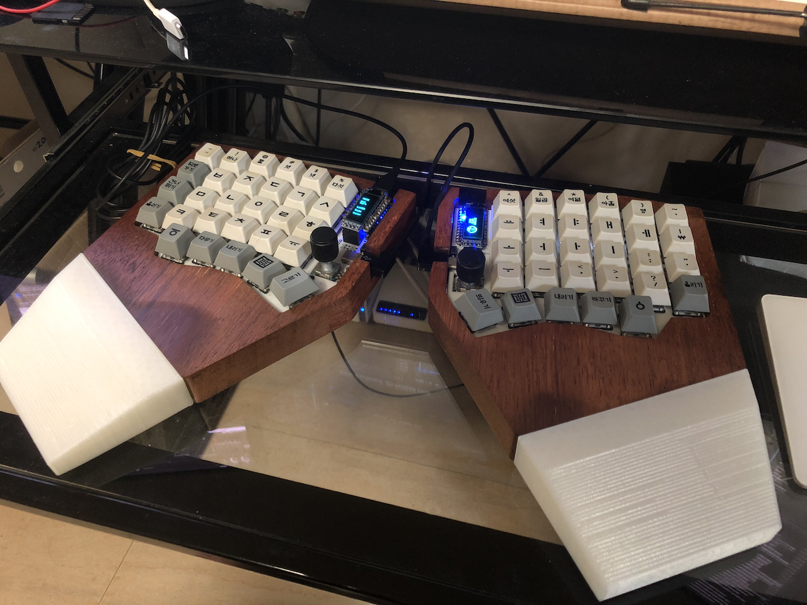
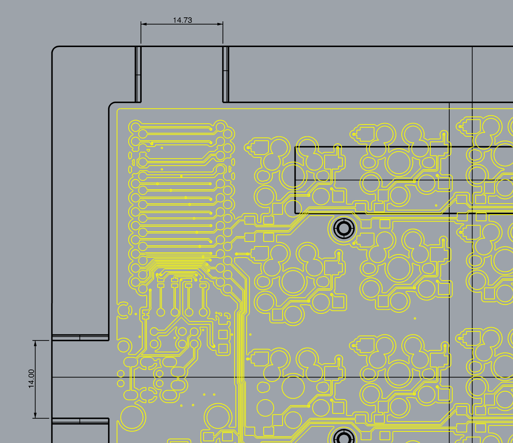

# Sofle Keyboard 3D Printed case

I added 3D printable STL files for Sofle Keyboard. Unfortunately, while I was trying to make sure that the board fits, Sofle v2 was launched and it doesn't work with the case I designed. If you still would like to use my case, you can find them under Sofle\_v1/case/3D\_print/ along with palm rests.

Case was CNC cut from STL file, palm rest was printed with ANYCUBIC i3 MEGA, PLA, 0.3mm layered.

I adjusted plug holes according to original sofle board. Instead of making it tight, I made the space large enough for better compatatibility.