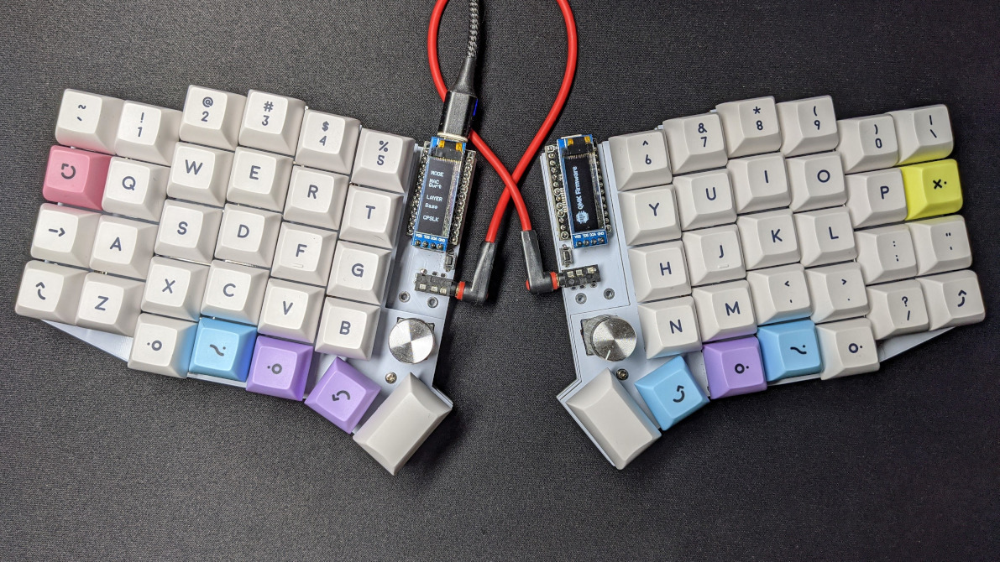
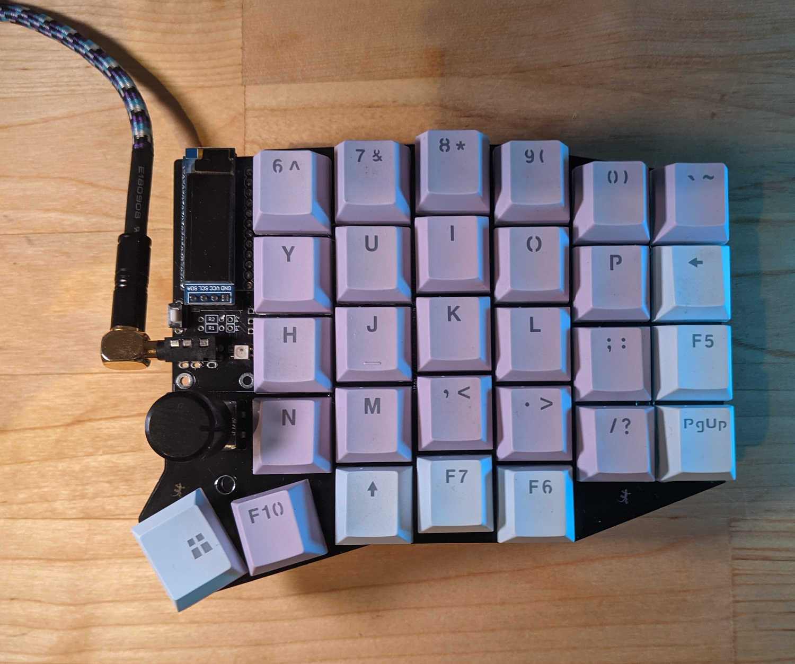
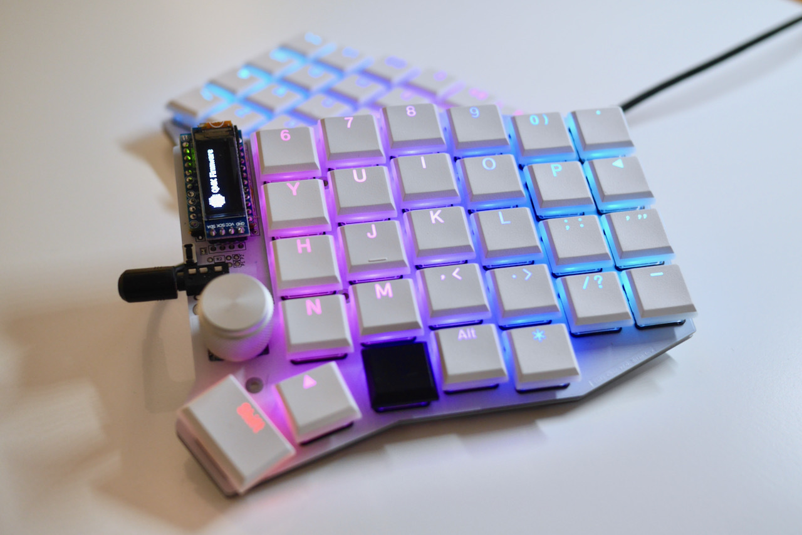
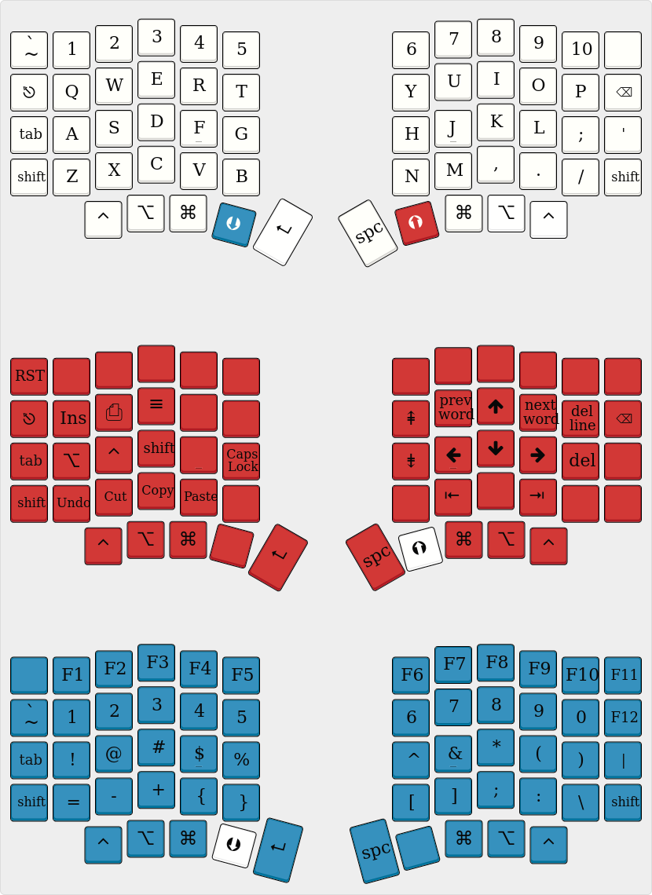
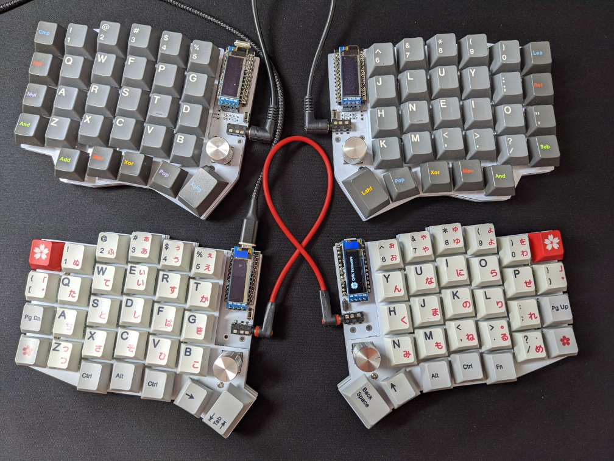
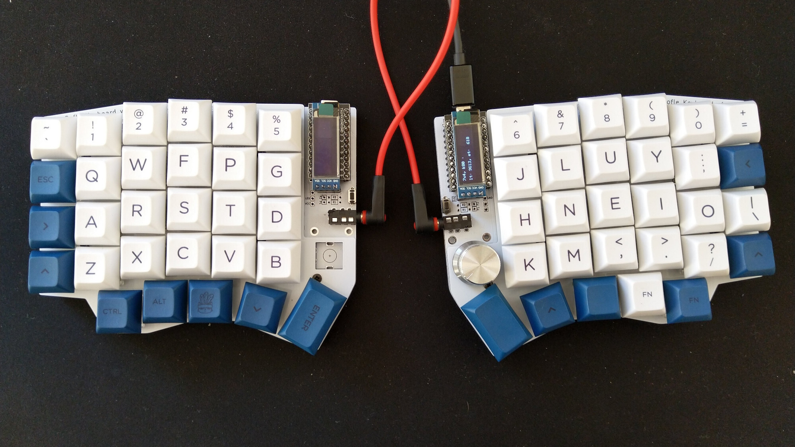
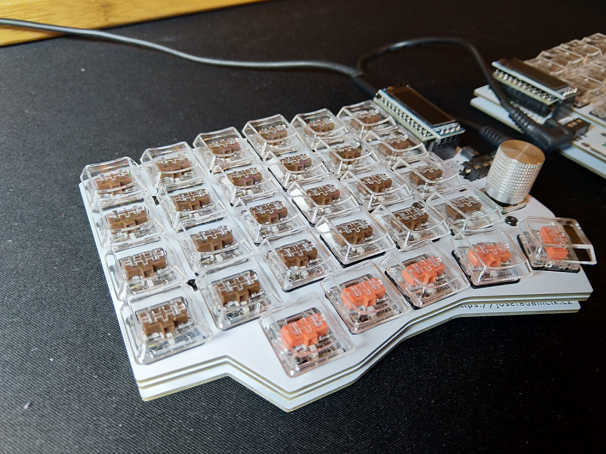
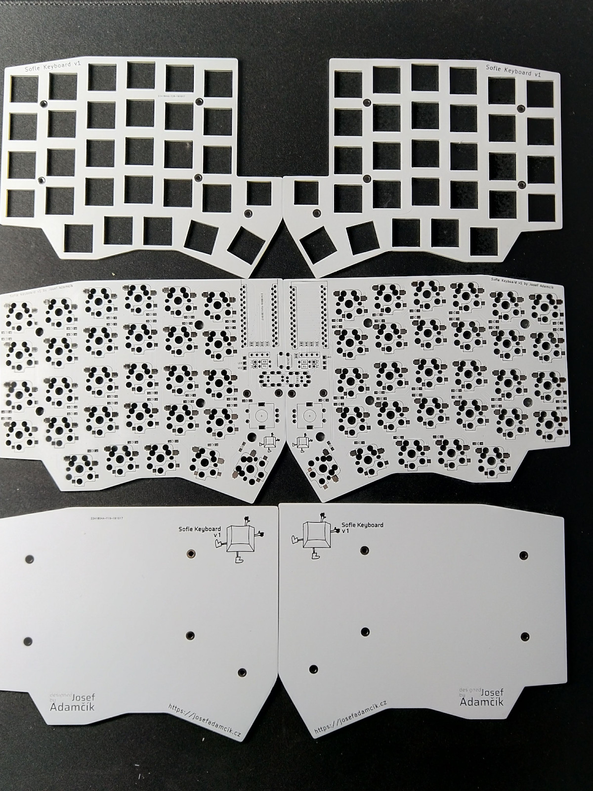
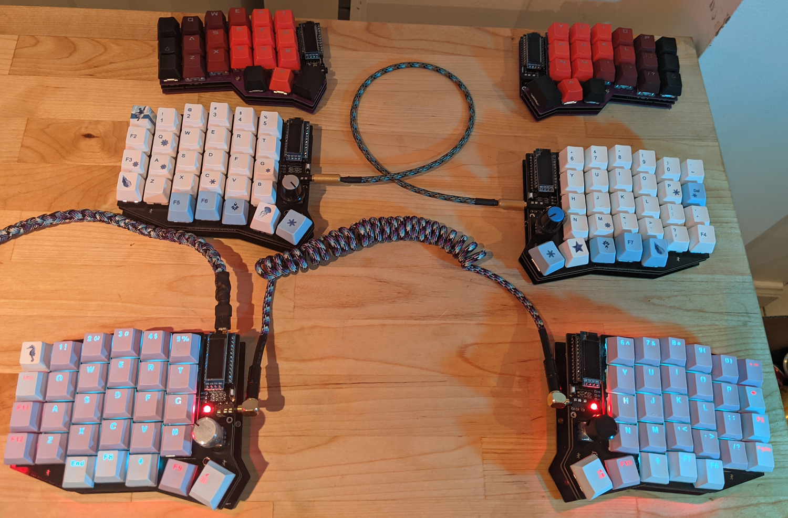
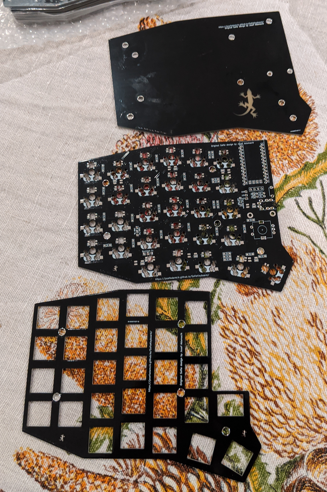

Sofle is 6×4+5 keys column-staggered split keyboard with encoder support. Based on [Lily58](https://github.com/kata0510/Lily58), [Corne](https://github.com/foostan/crkbd) and [Helix](https://github.com/MakotoKurauchi/helix) keyboards. SofleKeyboard version 1 and 2 were created by [Josef Adamcik](https://josef-adamcik.cz/). Sofle RGB was contributed by [Dane Evans](https://github.com/DaneEvans).

[Build guide is available here]({{ baseurl }}/SofleKeyboard/build_guide.html).

If you are interested in building the board and don't want to bother with KiCad, the gerber files are available in [releases](https://github.com/josefadamcik/SofleKeyboard/releases) or as [zip files in github repository](https://github.com/josefadamcik/SofleKeyboard/tree/master/Gerbers)

## Versions 

### Version 1

The first version is mostly a modification of Lilly58 Pro. Motivation and detailed information is covered in the following blog-post: [Let me introduce you SofleKeyboard - a split keyboard based on Lily58 and Crkbd](https://josef-adamcik.cz/electronics/let-me-introduce-you-sofle-keyboard-split-keyboard-based-on-lily58.html). 

There were several group buys and PCBs or kits were available through several sellers. 

[Build guide is available here]({{ baseurl }}/SofleKeyboard/build_guide.html).

### Version 2

Changes a stagger of columns and position of the bottom row a bit. The whole board was rerouted, shape changed slightly. Below version 1 in yellow, version 2 in blue.

A few experiments were made:

- A differently mounted micro-controllers with staggered holes.
- Placement of components around pro micros were also changed.
- Support for low profile Kailh Choc switches was dropped.

Those changes were experiments and I have been planning to reverse them and/or tweak them more. Details in the following blog-post: [Sofle Keyboard evolution: slow and not really steady](https://josef-adamcik.cz/electronics/soflekeyboard-evolving.html). 

Since the development was not moving forward for several months and there were many people interested in the new layouts (including group buys and vendors willing to sell kits), it was decided to release it in the current state as the version 2. Only one obvious problem was fixed (a too small size of a cut-out for encoder in the top plate).

[Build guide is available here]({{ baseurl }}/SofleKeyboard/build_guide.html).

### RGB

**&#9888; If you bought Sofle RGB from Keyhive, see the disclamer below, please.**

Sofle RGB was contributed by [Dane Evans](https://github.com/DaneEvans).

The Sofle RGB is a copy of the Sofle v2 with the addition of up to 36 RGB LEDs per side. If you are just looking to try out that layout, and are using the cherry sockets only, then this will work for you. 

The original pro-micro pinout was rolled back and routing was redone.

The OLED placement and OLED cover plate holes have not changed, and a plate has been designed. 

[Build guide is available here]({{ baseurl }}/SofleKeyboard/build_guide_rgb.html).

###	&#9888; Keyhive RGB

One keyboard vendor - Keyhive - is selling their own fork of Sofle RGB. This version is **modified** in way that makes it **incompatible** with the firmware for the official designs. You have to use the firmware provided by the vendor and build guide provided by them as well. Please, don't report problems with the desing and or firmware to this repository. Their modification is not part of the repository and therefore we cannot fix the problems or help you. Contact the vendor instead. In the end, you are their client.

[Build guide is available here]({{ baseurl }}/SofleKeyboard/build_guide_rgb.html).

### Choc

The Sofle Choc is a variation of the Sofle with:

   - low-profile, Kailh Choc switches
   - hotswap sockets
   - per-key RGB
   - thin, 15mm from desktop to top of keycaps
   - Sofle RGB switch layout with pinky stagger in between v1 and v2

The Sofle Choc was contributed by [Brian Low](https://github.com/brianlow) and based on the excellent Sofle RGB by [Dane Evans](https://github.com/DaneEvans).

[Build guide is available here]({{ baseurl }}/SofleKeyboard/build_guide_choc.html).

## Modifications

- [Sofle V2 with RJ12 intsead of TRRS](https://gitlab.com/LayeredRx/Sofle_V2_Rj12/) by Layered RX

## License

- Hardware source files are licensed under MIT license.
- The documentation (both on [josefadamcik.github.io/SofleKeyboard/](https://josefadamcik.github.io/SofleKeyboard/) and [https://josef-adamcik.cz/](https://josef-adamcik.cz/)) is licensed under [Creative Commons Attribution 4.0 International (CC BY 4.0)](https://creativecommons.org/licenses/by/4.0/) license. This includes all photos and images in this repository and on the website.
- Firmware is part of QMK firmware and has the same licence (GPL v2)

## Firmware 

Sofle uses [QMK firmware](https://qmk.fm/)

See the [build environment setup](https://docs.qmk.fm/#/getting_started_build_tools) and the [make instructions](https://docs.qmk.fm/#/getting_started_make_guide) for more information. Brand new to QMK? Start with our [Complete Newbs Guide](https://docs.qmk.fm/#/newbs).

Make example for this keyboard (after setting up your build environment):

    make sofle:default

Flash the default keymap: 

    make sofle:default:avrdude

Press reset button on he keyboard when asked.

Disconnect the first half, connect the second one and repeat the process.

You can also use [QMK configurator](https://config.qmk.fm/#/sofle/rev1/LAYOUT) but beware, it does not support rotary encoders yet.

## Default layout 

## Gallery

Version 1 at the top, version 2 at the bottom:

### Version 1

### RGB

