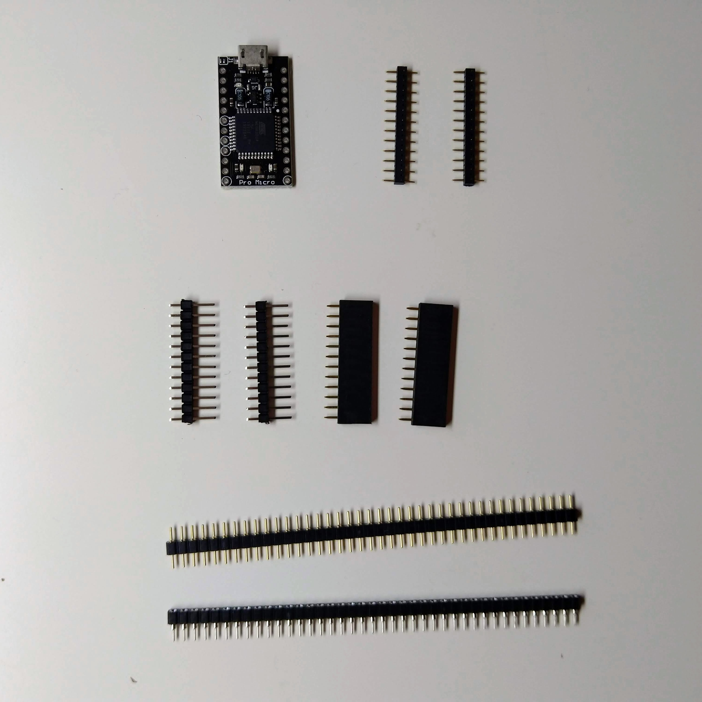
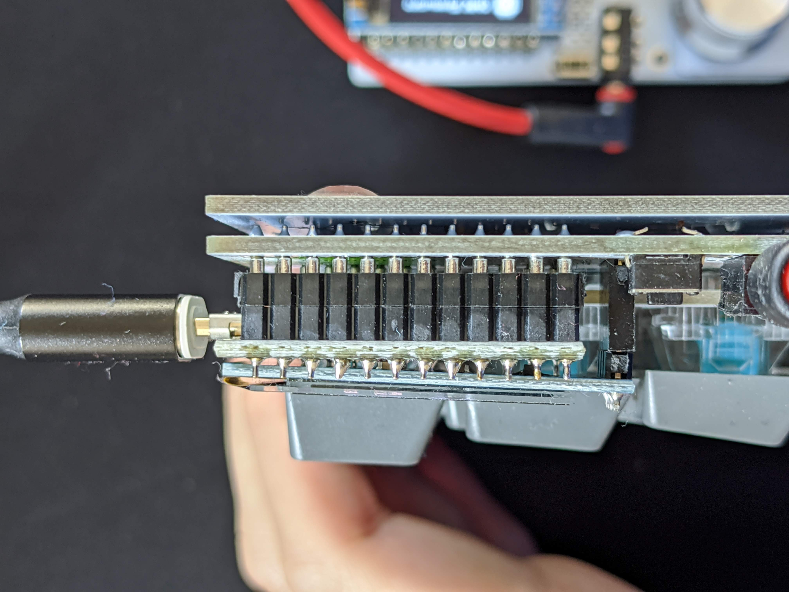

Sofle Keyboard is supposed to be simple DIY keyboard so it's possible to source all the parts yourself starting with PCBs, case plates and ending with every component on the board. In the case of PCBs and plates it might be more cost effective to buy them through a vendor but it's possible to go through manufacturing process as well. For the remaining components, most of them can be bought on Ebay on Aliexpress but buying a kit might be handy.

## Vendors

There are some vendors who are or were selling Sofle PCBs and/or kits. Things change over time so just google around and you may have luck finding someone.

## PCB manufacturing

If you decide that you wish to go through the PCB manufacturing process, you can. I should be easy enough even for people who don't know much about PCB manufacturing process. But keep in mind, nobody can guarantee that there are not going to be some problems and if you have no idea what are you doing it might be more difficult to deal with any issues along the way. 

### Getting Gerber files

The shortest way is to grab the [Gerber files for SofleKeyboard from releases Github][soflegerber].

You can also get source [KiCad projects on Github][soflegithub]. Open them in KiCad, plot Gerber files and drill files, compress them into a zip file. The instructions how the extract Gerber files from KiCad are everywhere and you can find them e.g. at the website of your chosen manufacturer. 

### Manufacturing

You should have 3 zip files which you need to upload/send to your manufacturer and have them made. There should be nothing special about the parameters you pick for manufacturing: 2-sided PCB, thickness 1.6 mm. Surface finish (keep in mind that the cheapest HASL contains lead. Lead is toxic. Consider using lead-free version and lead-free solder) and solder-mask color according to your taste. Other parameters could stay in their default values. You are going to need at least 2 pieces of PCB made from each zip file. Most likely the minimal quantity is going to be either 5 or 10 boards.

## Microcontroller boards

- [Original Pro Micro by SparkFun][promicroorig]. 
- [Clone from AliExpress][promicro]

Another alternative would be to use Elite-C which is a board using the same microcontroller as Pro Micro but with USB-C designed and made for DIY keyboards by [keeb.io][keebioelite]

### Sockets and pin headers for Pro Micro 

There are several ways how to mount Pro Micros to the board. Either the male PIN headers you most likely got with the board from the supplier could be used to solder it directly to the board or with high profile female pin headers (on the image in the middle.)

Build guides for Helix, Corne and Lily58 suggest [those spring pin headers][springpinheader](on the image at the top) which are very compact and give you non-permanent connection (you can remove or replace Pro Micros). But the link goes to a Japanese e-shop which is not shipping to Europe. ~~I haven't found any other place where those are available. All I can find is Japanese datasheet and this e-shop.~~ They were [briefly available at keycapsss.com][keycapsssockets] but at the time of writing they were already sold-out.

I ended up using low-profile round pin headers (on the image at the bottom) which take a bit more height but also allow me to remove Pro Micros and use them elsewhere. But for Corne, I just soldered them permanently. Here are [female ones][roundpinfemale] (soldered to board) and [male ones][roundpinmale] (soldered to Pro-Micro)

Another possible approach [is described at splitkb.com][promicrosocketing].

## Other parts

Bill of materials is part of the [build guide][buildguide].

Apart from encoders and encoder knobs the parts are exactly the same as for Lilly58. So you can try to find someone who is selling a bit for Lilly58 without PCBs. You can also look for parts at eshops which sell stuff for similar DIY keyboards (Corne, Lilly58a and similar). For example an EU based vendor [keycapsss][keycapsss] has a pretty nice stock

Most of the links below are to AliExpress and usually are the same I have ordered and used. They are meant for illustration. They are not affiliate links. It seems AliExpress is going to require you to be registered and logged in to see the detail of the product. I discovered that when putting this together and I am sorry for that but it's out of my control. 

- [Kailh MX Socket (AliExpress)][kailhsocketmx] 
- [Kailh Choc Socket (AliExpress)][kailhsocketchoc]
- [1N4148W Diodes in SOD123 package (AliExpress)][diodes]
- [TRRS connectors (AliExpress)][trrs]
- [Tactile button THT 2 pins][thtbuttons]
- [M2 brass spacers kit (AliExpress)][spacers] 
- [Adhesive rubber feet (AliExpress)][rubberfeet]
- [OLED display breakout (AliExpress)][oled]
- [EC11 rotary encoder (AliExpress)][encoder]
- [Encoder knob (AliExpress)][encoderknob]

[soflegerber]: https://github.com/josefadamcik/SofleKeyboard/releases "SofleKeyboard - gerber files"
[zilentsv2]: https://zealpc.net/products/zilents "Zilent V2 silent taktile switches by ZealPC"
{:target="_blank"}
[promicroorig]: https://www.sparkfun.com/products/12640 "Pro Micro by SparkFun"
{:target="_blank"}
[choc]: http://www.kailh.com/en/Products/Ks/CS/ "low profile switches from Kailh"
{:target="_blank"}
[trrs]: <https://www.aliexpress.com/item/32869968774.html> "TRRS conectors on Aliexpress"
{:target="_blank"}
[buttons]: <https://www.aliexpress.com/item/32981768203.html> "Buttons on Aliexpress"
{:target="_blank"}
[spacers]: <https://www.aliexpress.com/item/32974970926.html> "Brass spacers on AliExpress"
{:target="_blank"}
[rubberfeet]: <https://www.aliexpress.com/item/32839661456.html> "Rubber feet on Aliexpress"
{:target="_blank"}
[oled]: <https://www.aliexpress.com/item/32712441521.html> "OLED on AliExpress"
{:target="_blank"}
[promicro]: <https://www.aliexpress.com/item/32849563958.html> "ProMicro clone on AliExpress"
{:target="_blank"}
[springpinheader]: <https://yushakobo.jp/shop/a01mc-00/> "Spring pin headers - Japaneese"
{:target="_blank"}
[qmkprotonc]: https://qmk.fm/proton-c/ "QMK Proton-C"
{:target="_blank"}
[promicrosocketing]: <https://docs.splitkb.com/hc/en-us/articles/360011263059> "How do I socket a microcontroller? by splitkb.com"
{:target="_blank"}
[kailhsocketmx]: <https://www.aliexpress.com/item/32951252318.html> "Kailh MX sockets"
{:target="_blank"}
[kailhsocketchoc]: <https://www.aliexpress.com/item/33023283633.html> "Kailh Choc Sockets"
{:target="_blank"}
[diodes]: <https://www.aliexpress.com/item/32334222067.html> "1N4148W SOD123"
{:target="_blank"}
[encoder]: <https://www.aliexpress.com/item/4000891003225.html> "Encoder"
{:target="_blank"}
[encoderknob]: <https://www.aliexpress.com/item/2028814958.html> "Encoder Knob"
{:target="_blank"}
[thtbuttons]: <https://www.aliexpress.com/item/32981768203.html> "Tactile button"
{:target="_blank"}
[qmkintro]: <https://beta.docs.qmk.fm/newbs/newbs_getting_started> "QMK getting started"
{:target="_blank"}
[qmkhandedness]: <https://beta.docs.qmk.fm/features/feature_split_keyboard#setting-handedness> "QMK firmware - setting handedness"
{:target="_blank"}
[nooledlag]: https://github.com/qmk/qmk_firmware/issues/7522 "No OLED lag bug"
[soflegithub]: https://github.com/josefadamcik/SofleKeyboard "SofleKeyboard - KiCad project on Github.com"
[buildguide]: <{{ site.baseurl }}/build_guide.html> "Build guide"
[keycapsss]: <https://keycapsss.com/keyboard-parts/parts/?p=1> "Keycapsss - parts" 
{:target="_blank"}
[keycapsssockets]: <https://keycapsss.com/keyboard-parts/parts/91/spring-loaded-pin-headers-12-pin-2pcs-conthrough?c=11> "Keycapss - spring loaded pin headers."
{:target="_blank"}
[roundpinmale]: <https://www.aliexpress.com/item/32803164240.html> "Round pin header male"
{:target="_blank"}
[roundpinfemale]: <https://www.aliexpress.com/item/32817226478.html> "Round pin header female"
{:target="_blank"}
[keebioelite]: <https://keeb.io/products/elite-c-usb-c-pro-micro-replacement-arduino-compatible-atmega32u4> "Elite-C"
